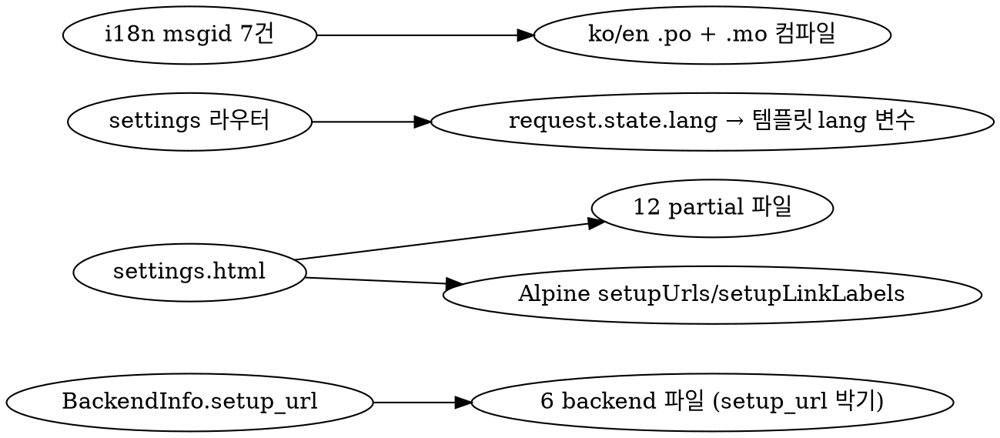

# Backend 카드 가격·셋업 안내 (Multi-backend LLM /settings 후속)

> M11 implementation 후속 design. 사용자 onboarding 경험 개선을 위한
> /settings 페이지 backend 카드 enrichment.

작성: 2026-05-20
브랜치: `feat/m11-multi-backend-llm` (M11 PR 에 누적 → v0.2.0 함께 publish)

## 1. 배경

M11 implementation 의 `/settings` 페이지는 6 backend 카드에 enabled
checkbox + API key input + 모델 입력만 표시한다. 사용자가 backend 를
처음 활성화할 때 다음 정보를 알 수 없다.

- 어디서 API key 를 발급하는가
- 무료인가 유료인가
- 무료이면 얼마나 쓸 수 있나
- 유료이면 얼마 정도 비용 들 것 같은가
- Ollama 의 경우 어떤 명령으로 모델을 받는가

사용자 (`v0o0v2@gmail.com`, 2026-05-20) 명시 요청:

> 각 모델별로 api키 받는 방법에 대한 설명이 들어가면 좋겠어. […]
> 올라마 같은 경우에는 gemma4 적용하는 것까지 자세하게 기술해줘. 그리고
> 각 모델마다 비용에 관한 내용을 추가 해줘. 무료나 유료인지. 무료이면
> 얼마나 쓸 수 있는지. 유료일때 얼마인지 (사용자가 감을 잠을 수 있게
> 예를 들어서)

## 2. 목표

- 각 backend 카드에 발급 페이지 direct link + 가격/셋업 안내
- 분량 조절: 기본은 접힘, 사용자가 클릭하면 펼쳐 보여줌 (`<details>`)
- i18n 지원: ko/en 양쪽 — settings 페이지가 이미 i18n 인 흐름과 정합
- 가격 정보 stale 위험 완화: 면책 문구 + 공식 가격 페이지 link

비-목표:
- 가격 자동 갱신 / live fetch — provider API 다양해 비현실적
- Ollama 외 backend 의 단계별 스크린샷 가이드 — provider docs 가 더 정확

## 3. 디자인 원칙

1. **접힌 상태가 기본** — 카드 분량을 키우지 않음. UX 깔끔 유지.
2. **i18n msgid 폭증 회피** — 안내 본문은 partial 파일로 분리, msgid 0건
3. **변경 비용 최소** — provider 가격 변동 시 partial 파일만 수정
4. **이미 결정된 best-known URL 박기** — WebFetch 검증 skip
   ([brainstorm 결정 2026-05-20](#sources))

## 4. 아키텍처

### 4.1 데이터 모델

`core/llm/base.py` 의 `BackendInfo` 에 신규 필드 추가:

```python
@dataclass(frozen=True)
class BackendInfo:
    name: str
    display_name: str
    homepage: str
    capabilities: BackendCapabilities
    setup_url: str | None = None  # M11 후속 — API key 발급 (또는 ollama 설치) 직접 link
```

6 backend 파일에 setup_url 박기:

| backend | setup_url |
|---|---|
| ollama | `https://ollama.com/download` |
| gemini | `https://aistudio.google.com/apikey` |
| claude | `https://console.anthropic.com/settings/keys` |
| openai | `https://platform.openai.com/api-keys` |
| openrouter | `https://openrouter.ai/settings/keys` |
| huggingface | `https://huggingface.co/settings/tokens` |

### 4.2 템플릿 구조

`src/assetcache/web/templates/settings/` 디렉터리 신규 생성:

```
settings/
├── help_ollama_ko.html
├── help_ollama_en.html
├── help_gemini_ko.html
├── help_gemini_en.html
├── help_claude_ko.html
├── help_claude_en.html
├── help_openai_ko.html
├── help_openai_en.html
├── help_openrouter_ko.html
├── help_openrouter_en.html
├── help_huggingface_ko.html
└── help_huggingface_en.html
```

각 partial 은 자유 HTML (msgid 없음). 한국어/영어 직접 작성. 구조:

```html
{# help_<name>_<lang>.html — 표준 골격 #}
<p><strong>{무료/유료 한 줄}</strong>{ · 추가 설명}</p>
<ul>
  <li>모델 / quota / 가격 항목 1</li>
  <li>모델 / quota / 가격 항목 2</li>
</ul>
<p class="disclaimer">
  <em>2026-05 기준. 최신은 <a href="{공식 가격 페이지}" target="_blank">공식 가격 페이지</a> 참조.</em>
</p>
```

Ollama 만 특별: 단계별 코드 블록 추가:

```html
<p><strong>무료</strong> · 자기 PC 에서 동작</p>
<ol>
  <li><a href="https://ollama.com/download" target="_blank">Ollama 설치</a> (Windows/Mac/Linux)</li>
  <li>터미널 열고: <code>ollama pull gemma4:e4b</code> (≈ 9.6 GB 다운로드)</li>
  <li>확인: <code>ollama list</code> → <code>gemma4:e4b</code> 가 보이면 OK</li>
</ol>
<p>위 모델 입력란의 기본값 <code>gemma4:e4b</code> 와 모델 ID 가 동일해야 합니다.</p>
```

### 4.3 settings.html 갱신

각 backend 카드 안에 `<details>` block 추가. 한 줄 안내 link 는 API key
input 바로 아래 small text 로:

```html
<fieldset class="backend-card">
  <legend>
    <input type="checkbox" :id="`bk-${name}-enabled`" x-model="backends[name].enabled">
    <label :for="`bk-${name}-enabled`" x-text="name"></label>
  </legend>

  {# M11 후속 — 가격 + 셋업 안내 (접힘 기본) #}
  <details class="backend-help">
    <summary>{{ _("ⓘ Pricing &amp; setup") }}</summary>
    
  </details>

  <label class="field" x-show="'api_key' in backends[name]">
    <span>{{ _("API key") }}</span>
    <input type="password" autocomplete="off" x-model="backends[name].api_key">
    {# 한 줄 setup link #}
    <small class="setup-link">
      <a :href="setupUrls[name]" target="_blank" rel="noopener noreferrer"
         x-text="setupLinkLabels[name]"></a>
    </small>
  </label>

  {# 기존 model_image / model_audio / model_embed input + Save / Test 버튼 #}
</fieldset>
```

Alpine 의 `setupUrls` 와 `setupLinkLabels` 는 `settingsForm()` 안에:

```javascript
setupUrls: {
  ollama: "https://ollama.com/download",
  gemini: "https://aistudio.google.com/apikey",
  claude: "https://console.anthropic.com/settings/keys",
  openai: "https://platform.openai.com/api-keys",
  openrouter: "https://openrouter.ai/settings/keys",
  huggingface: "https://huggingface.co/settings/tokens",
},
setupLinkLabels: {
  ollama: "{{ _('Download Ollama →') }}",
  gemini: "{{ _('Get key from Google AI Studio →') }}",
  claude: "{{ _('Get key from Anthropic Console →') }}",
  openai: "{{ _('Get key from OpenAI Platform →') }}",
  openrouter: "{{ _('Get key from OpenRouter Settings →') }}",
  huggingface: "{{ _('Get token from HuggingFace →') }}",
},
```

`lang` 변수는 settings 라우터에서 `request.state.lang` 추출 → 템플릿
컨텍스트 전달 (현재 LocaleMiddleware 가 `request.state.lang` 셋팅).

### 4.4 i18n msgid 추가 (7건)

- `"ⓘ Pricing & setup"` — details summary
- `"Download Ollama →"`
- `"Get key from Google AI Studio →"`
- `"Get key from Anthropic Console →"`
- `"Get key from OpenAI Platform →"`
- `"Get key from OpenRouter Settings →"`
- `"Get token from HuggingFace →"`

partial 본문은 ko/en 직접 작성 — msgid 0건 (i18n 폭증 회피).

## 5. 컴포넌트 의존도



## 6. 데이터 플로우

1. 사용자가 `/settings` 페이지 진입 → `settings.html` 렌더링
2. settings 라우터가 `request.state.lang` (LocaleMiddleware 가 셋팅) 을 추출, 템플릿 컨텍스트 `lang` 변수에 전달
3. 6 backend 카드 각각 `` 로 partial 포함
4. Alpine `setupUrls[name]` 가 API key input 아래 link `href` 에 바인딩
5. 사용자가 link 클릭 → 새 탭으로 provider 의 발급 페이지 이동

## 7. 에러 처리

- partial 파일 missing → Jinja2 `TemplateNotFound` 예외 → 500 에러. 마이그레이션
  시 12 파일 모두 commit 필수
- `lang` 변수 missing or invalid → "en" 으로 폴백 (settings 라우터에서
  `getattr(request.state, "lang", "en")`)
- `setup_url=None` 인 backend 가 미래 추가될 경우 (이론적 — 현재 6 backend
  모두 setup_url 박음) — Alpine `setupUrls[name]` 가 undefined 면 link 표시
  안 함 (`x-show="setupUrls[name]"`)

## 8. 테스트 전략

- `test_backend_info_setup_url.py` (1 케이스): 6 backend 의 `info.setup_url`
  이 정확한 URL 인지 검증
- `test_settings_router_m11.py` 확장 (+2 케이스):
  - ko locale 에서 `/settings` 응답에 `help_gemini_ko.html` 내용 포함
  - en locale 에서 동일 페이지에 `help_gemini_en.html` 내용 포함
- `test_settings_partials_exist.py` (1 케이스): 12 partial 파일 모두 존재

총 신규 +4 테스트. 회귀 1239 → 1243 예상.

## 9. 알려진 한계 / 후속

- 가격이 변동되면 partial 파일 직접 갱신 필요 (자동화 없음) — 면책
  문구로 사용자에게 안내, provider 가격 페이지 link 제공
- Ollama 의 `gemma4:e4b` 모델 ID 변경 시 partial 갱신 — 현재 cfg
  기본값과 동기화 필요 (변경 가능성 낮음, Google 모델 안정적)
- Browser tab title prefetch / link preview 는 별도 작업 (M14+)

## 10. 데이터 (가격 정보, 2026-05 조사) <a name="sources"></a>

각 partial 작성 시 본문 데이터:

### Ollama
- 무료, local
- gemma4:e4b ≈ 9.6 GB 다운로드
- 명령: `ollama pull gemma4:e4b`, 확인: `ollama list`

### Gemini ([공식](https://ai.google.dev/gemini-api/docs/pricing))
- 무료 tier: gemini-2.5-flash 1,500 req/day · 15 RPM · 1M TPM (카드 등록 불필요)
- 유료: $0.30 input / $2.50 output per 1M tokens (gemini-2.5-flash)
- embedding (gemini-embedding-001): 무료 tier 있음

### Claude ([공식](https://platform.claude.com/docs/en/about-claude/pricing))
- 유료 only (가입 시 trial credit)
- claude-haiku-4-5: $1 input / $5 output per 1M tokens
- 가벼운 예: 이미지 분석 1회 ≈ 1.5K input tokens → 1만 회 ≈ $15

### OpenAI ([공식](https://openai.com/api/pricing/))
- 유료 only (가입 시 trial credit)
- gpt-4o-mini: $2.50 input / $10 output per 1M (또는 GPT-4.1 Mini $0.40/$1.60)
- text-embedding-3-small: $0.02 per 1M tokens

### OpenRouter ([공식](https://openrouter.ai/pricing))
- 무료 tier: 50 req/day (카드 없음) · $10 credit 추가 시 1,000 req/day
- 무료 모델: `:free` suffix (예: `google/gemma-4-27b-it:free`) — 25+ 개
- 유료 모델: provider 가격 동일 pass-through

### HuggingFace ([공식](https://huggingface.co/docs/inference-providers/pricing))
- 무료 tier: 월 small credits (정확한 양 비공개)
- PRO ($9/month): 20× credits (약 2M monthly usage)
- 모델별 가격: provider pass-through (HuggingFace 추가 수수료 없음)

## 11. 구현 순서

writing-plans skill 에서 상세 plan 작성. 대략 흐름:

1. `BackendInfo.setup_url` 필드 추가 + 6 backend 파일 박기 + 테스트
2. 12 partial 파일 작성 (ko/en × 6)
3. `settings.html` 갱신 (`<details>` block + 한 줄 link + Alpine setupUrls)
4. settings 라우터에 `lang` 컨텍스트 변수 전달
5. i18n msgid 7건 추가 (ko/en) + .mo 컴파일
6. 테스트 +4 케이스
7. 전체 회귀 1239 → 1243 확인 + 커밋
